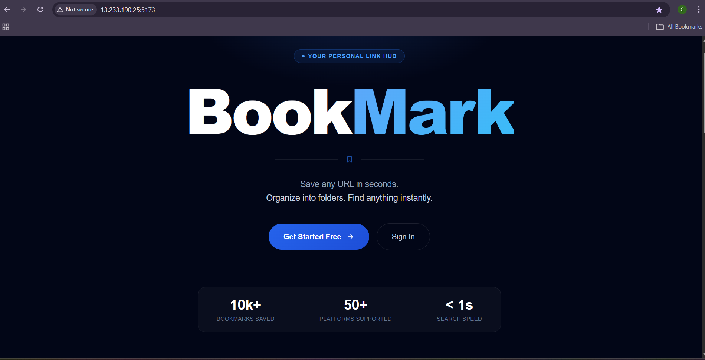
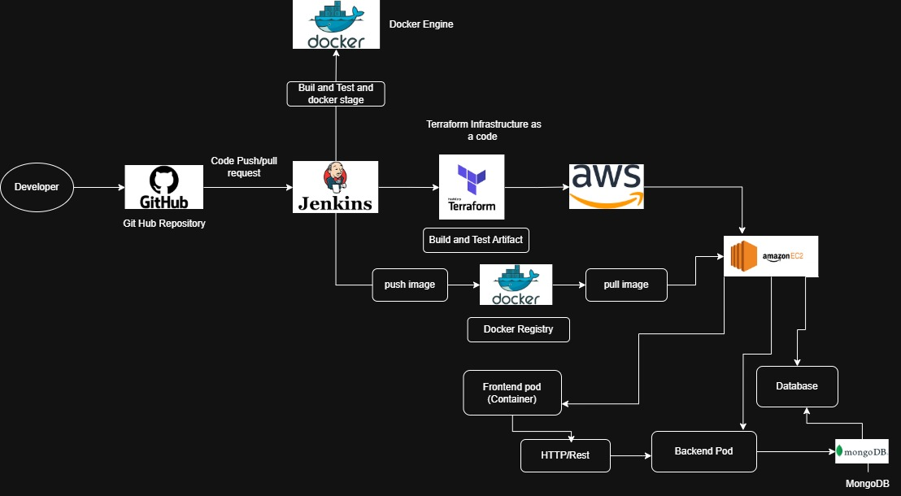
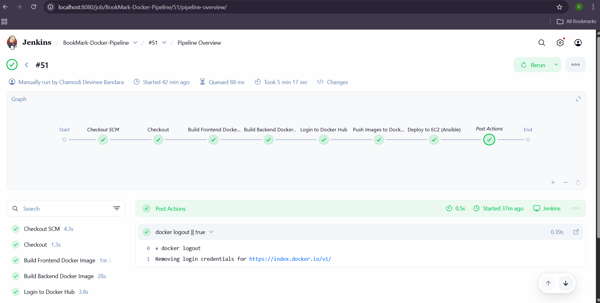

# 🚀 BookMark — DevOps Driven Link Manager

<p align="center">
  
</p>

---

## 🌐 Live Demo

👉 http://13.233.190.25:5173/

---

## 🏗️ System Architecture



---

## 🔄 CI/CD Pipeline



---

## 🎯 DevOps Overview

This project demonstrates a **complete DevOps lifecycle**, including:

* CI/CD pipeline using Jenkins
* Containerization with Docker
* Image management via Docker Hub
* Infrastructure provisioning using Terraform
* Deployment automation using Ansible
* Cloud hosting on AWS EC2

---

## 🧠 Application Purpose

BookMark helps users to:

* 🔗 Save important URLs
* 📁 Organize them using folders
* 🔍 Search and retrieve instantly

---

## ⚙️ Technologies Used

### 💻 Application Stack


---

### 🚀 DevOps Stack


---

## 🐳 Containerization

The system is built using **3 Docker containers**:

* Frontend (React)
* Backend (Node.js + Express)
* Database (MongoDB)

---

## 🔁 CI/CD Workflow

```bash
Developer → GitHub → Jenkins → Docker Build → Docker Hub → Terraform → Ansible → AWS EC2 → Live App 🚀
```

---

## 📊 Key Highlights

✔ Automated CI/CD pipeline
✔ Containerized architecture
✔ Cloud deployment on AWS
✔ Infrastructure as Code
✔ Scalable and production-ready setup

---

## 🚀 Future Improvements

* Authentication system
* Kubernetes deployment
* Monitoring (Prometheus + Grafana)

---

## 👩‍💻 Author

**Chamodi Devinee Bandara**
Computer Engineering Undergraduate
University of Ruhuna

---
